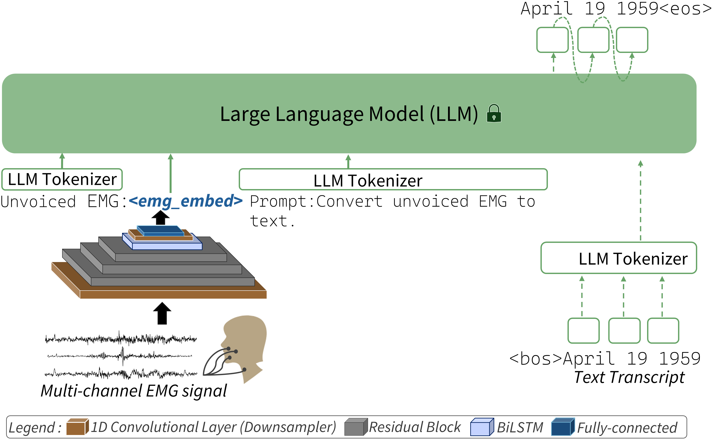

# SSSR: Smart Silent Speech Reader

**sEMG-based silent speech recognition using frozen large language models**

**--->(AML Lab Project at the EEE Department, Imperial College London)**

An end-to-end system that decodes unvoiced speech from surface electromyography (sEMG) signals using a lightweight convolutional–recurrent adaptor paired with a frozen LLM. Built with consumer-grade hardware at ~20% of the cost of research-grade setups.

<p align="center">
  
</p>

## Highlights

| Result | Value |
|--------|-------|
| Best WER (Gaddy closed-vocab, 8ch) | **0.3285** (vs 0.49 base paper — 33% improvement) |
| Best CER (Gaddy closed-vocab, 8ch) | **0.1476** |
| 4-channel WER | 0.4088 |
| 3-channel WER | 0.4745 (still beats prior 8ch baseline) |
| 10-word personal vocab accuracy | **92%** with 3 channels, 250 samples |
| LLMs compared | 8 (Gemma-2, Phi-3, DeepSeek, LLaMA, Qwen, StableLM, SmolLM, LiquidAI) |
| Adaptor parameters | 1.9M – 10.1M (LLM stays frozen) |
| Hardware cost | ~£200 (vs ~£1,000 for Gaddy & Klein setup) |

## Pipeline

```
Facial Muscles → MyoWare 2.0 Sensors (4ch) → Arduino Uno R4 (1kHz ADC)
    → Serial → Host PC → Feature Extraction (14 HC features/channel)
    → EMG Adaptor (Conv1D → ResBlocks → BiLSTM → LayerNorm)
    → Frozen LLM (Gemma-2-2b-it) → Decoded Text
```

## Repository Structure

```
SSSR/
├── firmware/                # Arduino firmware & host serial controller
├── data_preprocess/         # Feature extraction, normalization, channel selection
├── model/                   # Adaptor architecture (ResBlocks, LSTM, Transformer)
├── training/                # Training scripts (improved, ablation, fruit vocab)
├── inference/               # Evaluation & real-time inference
├── analysis/                # Result parsing & visualization
├── hpc/                     # HPC job scripts (PBS) & environment setup
├── config/                  # Train/dev split configuration
├── report/                  # LaTeX source for final report
└── data/                    # Data directory (not tracked — see data/README.md)
```

## Setup

### Environment

```bash
# Create conda environment
conda create -n emg_llm python=3.11 -y
conda activate emg_llm

# Install PyTorch (adjust CUDA version as needed)
pip install torch torchvision torchaudio --index-url https://download.pytorch.org/whl/cu121

# Install remaining dependencies
pip install -r requirements.txt
```

### Data

Download the Gaddy & Klein pre-extracted HC features from [Zenodo](https://zenodo.org/records/15557946) and place them in `data/extracted_emg_features/`. See [`data/README.md`](data/README.md) for details.

## Usage

### Training

**Reproduce base paper (LLaMA-3.2-3B, 8 channels):**
```bash
python training/train_hc_llama3b_improved.py \
    --feature_dir data/extracted_emg_features \
    --llm_model meta-llama/Llama-3.2-3B-Instruct \
    --model_size 768 \
    --epochs 500 \
    --batch_size 16 \
    --lr 1e-3
```

**Best configuration (Gemma-2-2b-it, all 10 improvements):**
```bash
python training/train_hc_llama3b_improved.py \
    --feature_dir data/extracted_emg_features \
    --llm_model google/gemma-2-2b-it \
    --model_size 768 \
    --epochs 500 \
    --batch_size 16 \
    --lr 1e-3 \
    --cosine_lr \
    --dropout 0.15 \
    --grad_clip 1.0 \
    --layer_norm \
    --label_smoothing 0.1 \
    --augment \
    --weight_decay 0.05
```

**Ablation study:**
```bash
python training/train_ablation.py \
    --feature_dir data/extracted_emg_features \
    --llm_model google/gemma-2-2b-it \
    --stages 0 1 2 3 4 5 6 7 8 9
```

### Inference

**Evaluate on Gaddy dev set:**
```bash
python inference/inference_hc.py \
    --feature_dir data/extracted_emg_features \
    --checkpoint checkpoints/best_transNet.pth \
    --llm_model google/gemma-2-2b-it
```

**Real-time inference (requires Arduino + sensors):**
```bash
python inference/realtime_inference.py \
    --checkpoint checkpoints/best_transNet.pth \
    --llm_model google/gemma-2-2b-it \
    --serial_port /dev/ttyACM0
```

### Feature Extraction (Personal Data)

**Convert raw EMG CSVs to HC features:**
```bash
python data_preprocess/convert_my_emg.py \
    --input_dir <raw_csv_directory> \
    --output_dir data/my_features/ \
    --robust_norm --stft_prenorm --clip 5.0
```

**Channel selection (reduce 8ch → N channels):**
```bash
python data_preprocess/extract_nch_features.py \
    --input_dir data/extracted_emg_features \
    --output_dir data/features_4ch \
    --n_channels 4
```

### HPC (Imperial College PBS)

See `hpc/setup_env.sh` for one-time environment setup, and the `.pbs` scripts for example job submissions:
```bash
qsub hpc/run_train_improved.pbs      # Main training
qsub hpc/run_ablation.pbs            # Ablation study
qsub hpc/run_gaddy_benchmarks.pbs    # 8ch/4ch/3ch benchmarks
```

## Hardware

| Component | Specification | Cost |
|-----------|--------------|------|
| Arduino Uno R4 Minima | 14-bit ADC, 1 kHz sampling | ~£20 |
| MyoWare 2.0 Sensors (×4) | Bipolar differential, 20–500 Hz bandpass | ~£120 |
| MyoWare Arduino Shield | Connects up to 6 sensors | ~£9 |
| ArduLink cables (×4) | 3.5mm jack sensor-to-shield | ~£20 |
| Ag/AgCl electrodes | Disposable snap electrodes | ~£8/session |
| **Total** | | **~£200** |

Firmware: [`firmware/DAQ_host_controlled.ino`](firmware/DAQ_host_controlled.ino) — 4-channel simultaneous ADC with ring buffer and non-blocking serial transfer.

## Key Results

### Ablation Study (Gemma-2-2b-it, 8 channels)

| Stage | Improvement | WER | ΔWER |
|-------|-----------|-----|------|
| S0 | Baseline | 0.9635 | — |
| S2 | + Prompt-consistent inference | 0.6277 | −0.336 |
| S5 | + Dropout (0.15) | 0.4307 | −0.153 |
| S6 | + Output LayerNorm | 0.3212 | −0.110 |
| S9 | + Weight decay (all improvements) | **0.3285** | — |

### Channel Reduction (Gemma-2-2b-it)

| Channels | WER | CER |
|----------|-----|-----|
| 8 | 0.3285 | 0.1476 |
| 4 | 0.4088 | 0.2077 |
| 3 | 0.4745 | 0.2507 |

## Architecture Details

The EMG adaptor (TransductionModelImproved) maps HC features to the LLM's embedding space:

```
Input: [batch, time, 112]     (8ch × 14 features)
  → Conv1D(k=6, s=6)          Temporal downsampling
  → 3× ResBlock               Feature extraction
  → BiLSTM                    Sequential modelling
  → Conv1D(k=2, s=2)          Further downsampling
  → Linear → LayerNorm        Project to LLM hidden dim
Output: [batch, T/48, 2304]   (Gemma-2 embedding dim)
```

The adaptor output is concatenated with prompt embeddings and fed to the frozen LLM for autoregressive text generation.

## References

- Mohapatra, P., Mirabad, F., & Chen, Y. (2025). *Can LLMs Understand Unvoiced Speech?* ACL 2025. [[Paper]](https://arxiv.org/abs/2409.02951)
- Gaddy, D. & Klein, D. (2020). *Digital Voicing of Silent Speech.* EMNLP 2020.
- Sun, J. et al. (2022). *Silent Speech Recognition using sEMG and Arduino.* AML Lab, Imperial College London.

## Acknowledgements

This project was developed as part of the Applied Machine Learning Laboratory at Imperial College London, Department of Electrical and Electronic Engineering.

**Supervisors:** Prof. Krystian Mikolajczyk, Dr. Yassir Jedra, Dr. Abd Al Rahman Abu Ebayyeh

**Authors:** Yash M Agarwal, Ivan Plakhotnyk, Dorijan Donaj Magašić
